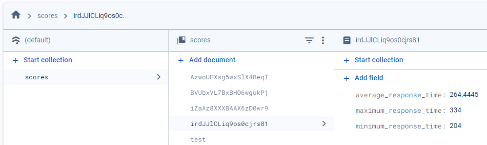

# Exercise 1
max_bright = 45000  

min_bright = 20000  

based on my room with lights on vs. off during late afternoon (dim vs. bright)

# Exercise 2
Updated exercise_sound.py to play Seven Nation Army by The White Stripes

# Exercise 3
Updated exercise_game.py to calculate average, min, max response times for 10 trials.  
File includes code to upload response time data to Cloud (Firebase Firestor database).  
A resulting JSON file also included in repository.  
User Story: The user will start the game on the Pico and hit the button whenever they see the light flash on. Once the game finishes (after 10 flashes), data regarding the user's response times to the flashes (minimum, maximum, and average) will be uploaded to the cloud (Firebase Firestore database). Then, the user will be able to go to a website, login through Google, and view their recorded scores and response time data.  
Here is the link to the website showing a user their scores:  
https://2024-mini-tau.vercel.app/  
  
Link to Firebase Cloud Firestore: 
https://console.firebase.google.com/project/ec463-mini-project-ex3/firestore/databases/-default-/data/~2Fscores~2F5HZH8a3MD94nYdQ1pmvh 
